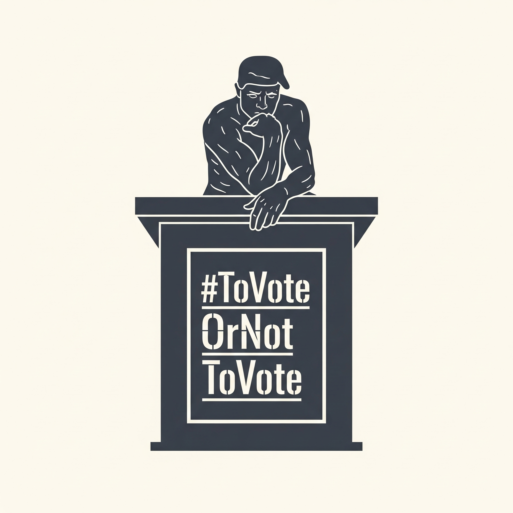

# ToVoteOrNotToVote
Project for Introduction to Neuro-Economics (CG4.402) 

## Problem Statement
Behavioural Insights into Voter Turnout and Electoral Participation

## Motivation and Core Idea
Voter turnout is a cornerstone of a healthy representative democracy, yet its drivers remain a subject of intense
study. Classical rational choice models, which posit that individuals vote only if the instrumental benefit of affecting the
outcome outweighs the cost, fail to explain why millions of people participate in large-scale elections—a phenomenon
often termed the "paradox of voting"

The core idea of this project is to reframe the voting decision from a purely rational act to a behavioral one, governed
by an individual’s net perceived utility. We posit that a person’s choice to vote or abstain is a function of a wide
array of factors that shape their subjective valuation of the act. This utility is not static but is a dynamic function of
the individual’s personal characteristics (demographics, beliefs, biases) and the specific electoral context (election
competitiveness, media narrative, institutional trust). Our guiding principle is to move beyond explaining the act of
voting and towards understanding the perceived value of the vote itself.

### Author:
Prakhar Singhal
Sativika Miryala
### Professor:
Kavita Vemuri

shared docs link : https://docs.google.com/document/d/1vVrsJBam620mNK4NxdRgmdIZSaYYbxTCB5HZaB07wNc